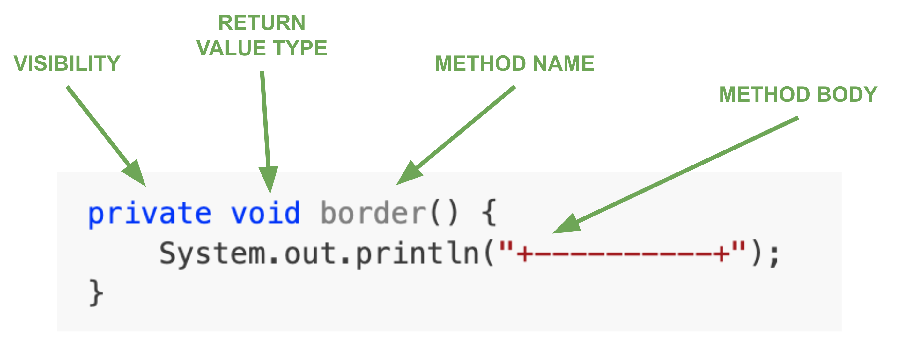

# Introduction to Methods

So far, we have been writing code as one long sequence inside the `run()` block. As programs grow in length and complexity, this becomes:

- more difficult to read,
- more difficult to debug, and
- more difficult to extend.

To keep our programs organized, we will use **methods**.

A method is a **small, named block of code** that does one job.  Once defined, we can **call** the method whenever we need that job done.

### Why Use Methods?

| Benefit | Meaning |
|--------|---------|
| **Avoid repetition** | Write code once, reuse it many times |
| **Clearer organization** | Break a large problem into smaller steps |
| **Easier debugging** | Fix code in one place instead of several |
| **More maintainable** | Changes happen in one location |
| **Modular thinking** | Each method does *one thing well* |

As in life, it often helps to break big tasks into small, meaningful units. The momentous task of packing and moving an entire home might be easier if we thought of packing each room one by one.

This idea — breaking work into small, meaningful units — is central to all good programming.

<br>

### Example: Using Methods to Reduce Repetition

Suppose we want to draw a simple box using text output:

```
+----------+
|          |
|          |
+----------+
```

#### Without Methods

```java
public void run() {
    System.out.println("+----------+");
    System.out.println("|          |");
    System.out.println("|          |");
    System.out.println("+----------+");
}
```

If we later decide the box should be wider, we must manually update multiple lines. This is **repetitive** and **hard to change**.

#### With Methods
We can define two methods:
```java
private void border() {
    System.out.println("+----------+");
}

private void middle() {
    System.out.println("|          |");
}
```

So now our main program looks like:
```java
public void run() {
    border();
    middle();
    middle();
    border();
}
```

This is a better solution because:

- Changing the width requires only two updates (i.e., one update in the `border()` method, and one update in the `middle()` method)
- `run()` now reflects the structure of the box
- Code becomes easier to understand

#### With Methods (Even Better)

```java
public void run() {
    int height = 10;
    border();
    for (int i = 0; i < height; i++) {
        middle();
    }
    border();
}
```

Now the `height` of the box can be changed by adjusting just one number.


#### Summary of Improvements

| Without Methods | With Methods |
|----------------|--------------|
| Hard to update | Change one method instead of many lines |
| Repeated code everywhere | Repetition is removed |
| Code doesn’t show intent | Code visually matches the shape being drawn |
| Mistakes are easy to introduce | Easier to debug and maintain |


Using methods makes your code cleaner, more organized, easier to read and maintain. 

<br>

## Method Structure
Here is one of the methods we defined earlier:

```java
private void border() {
    System.out.println("+----------+");
}
```

The first line is called the **method header**. It tells us everything we need to know about the method before it runs:



### Breaking Down the Method Header

| Part | Description |
|------|-------------|
| `private` | This is the **visibility** of the method. It specifies "who" is allowed to use it. For now, we will simply make most of our helper methods `private`. (It will become clearer when we study object-oriented design in ICS4U.) |
| `void` | This tells us that the method does not **return a value**. Later, we will learn how methods can send information back to the program. |
| `border()` | This is the **method name** followed by parentheses. The name should follow variable naming rules and describe what the method *does* or *represents*. (We will learn about putting values inside the parentheses soon.) |
| `{ ... }` | The **method body** contains the statements that actually run when the method is called. |

For now, you can think of a method as a **named section of code** that we can “jump to” whenever we want to reuse that code.

When our program calls the method:

```java
border();
```

the computer temporarily jumps to the method body, runs its statements, and then returns to where it left off.

<br>

## Calling a Method (Control Flow)

When you call a method, execution:
1. **pauses** in the calling method
2. **jumps** to the new method
3. runs the method's **body**
4. **returns** to the original calling method's location and continues

For example, given the code:

```java
L1  public void run() {
L2      border();
L3      middle();
L4      middle();
L5      border();
L6  }
```
The execution order goes something like:

```
run() → border() → return to L2 and continue run()
      → middle() → return to L3 and continue run()
      → middle() → return to L4 and continue run()
      → border() → return to L5 and continue run()
```

This “jump out and return” idea applies to every method you will write.

<br>

## Where Do We Write Our Methods?

So far, all of our programs have looked something like this:

```java
public class Main extends ConsoleProgram {
    public void run() {
        System.out.println("Hello, World!");
    }
}
```

When we start creating our own methods, we will continue to write all of our main program logic inside `run()`, and we will define our helper methods **below** it.

### Example Template

```java
public class Main extends ConsoleProgram {

    public void run() {
        // Program steps go here
        // You will call your methods from here
    }

    // ↓↓↓ Your methods go below run() ↓↓↓

    private void myFirstMethod() {
        // one job goes here
    }

    private void mySecondMethod() {
        // another job goes here
    }

}
```

### Why Do We Put Methods Below `run()`?

- `run()` should act like the “table of contents” — it shows the overall structure of the program.
- Helper methods support `run()` and are kept lower down to avoid distractions.
- It keeps your program easy to scan and understand.

### Style Notes (for consistency)

| Rule | Example |
|------|---------|
| Leave **one blank line** between method definitions | Makes code visually grouped and readable |
| Method names should describe what they **do** | `drawBorder()`, `printMenu()`, `playChorus()` |
| Methods should do **one job well** | If a method starts becoming long, break it up |

We’ll learn how to comment methods later, but for now, focus on clear structure and clean spacing.

<br>

# Practice Problems
Here are several practice problems requiring the use of methods. Your job is to take code that currently has repetition or messy structure and rewrite it using methods.

You can find the starter code in the `src/` folder of this repository.

## Program1.java — Basic Method Call
Write a basic method that says hello:

```java
public class Program1 extends ConsoleProgram {
    public void run() {
        // TODO: Create a method greet() that prints "Hello!"
        // Call it 3 times.
    }
    
    // define greet() below
}
```

## Program2.java — Replace Repetition
Use a method to minimize the repetitive code in this program:

```java
public class Program2 extends ConsoleProgram {
    public void run() {
        System.out.println("Good morning!");
        System.out.println("Good morning!");
        System.out.println("Good morning!");
        System.out.println("Good morning!");
        System.out.println("Good morning!");
        System.out.println("Good morning!");
        System.out.println("Good morning!");
        System.out.println("Good morning!");
        System.out.println("Good morning!");
        System.out.println("Good morning!");
        System.out.println("Good morning!");
        System.out.println("Good morning!");

        // TODO: replace repetition with morning() method
    }
}
```

## Program3.java — Sing the Chorus
Create methods to output the chorus of this Beatles tune.
```java
public class Program3 extends ConsoleProgram {
    public void run() {
        // Output:
        // na na na na na 
        // na na na na na
        // hey Jude
        // na na na na na
        // na na na na na
        // hey Jude

        // TODO: create chorus() for repeated lines
    }
}
```

## Program4.java — Dividing Line
Combine regular output statements with a method that prints the divider line.
```java
public class Program4 extends ConsoleProgram {
    public void run() {
        System.out.println("Menu");
        System.out.println("-------------------");
        System.out.println("1) Play");
        System.out.println("2) Quit");
        System.out.println("-------------------");

        // TODO: replace repeated dashes with line()
    }
}
```

## Program5.java — Baby Shark
Look for repetition and create methods to print the lyrics of this song:
```java
public class Program5 extends ConsoleProgram {
    public void run() {
        // Output:
        // Baby shark, doo doo doo doo doo doo
        // Baby shark, doo doo doo doo doo doo
        // Baby shark, doo doo doo doo doo doo
        // Baby shark!

        // Mommy shark, doo doo doo doo doo doo
        // Mommy shark, doo doo doo doo doo doo
        // Mommy shark, doo doo doo doo doo doo
        // Mommy shark!

        // Daddy shark, doo doo doo doo doo doo
        // Daddy shark, doo doo doo doo doo doo
        // Daddy shark, doo doo doo doo doo doo
        // Daddy shark!
        //
        // TODO: create methods to print the lyrics
        //       of the song, reusing code
        //       wherever possible
    }
}
```

## Program6.java — Building Towers
```java
public class Program6 extends ConsoleProgram {
    public void run() {
        // Ask the user for a tower height and draw
        // a tower based on their input. For example:
        //
        // Height? 4
        // +----------+
        // |          |
        // |          |
        // +----------+

        // TODO: make methods for the top/bottom and sides
        //       get user input
        //       use a loop to draw tower
    }
}
```

## Program7.java — Modular Ladder
```java
public class Program7 extends ConsoleProgram {
    public void run() {
        // We want to draw a ladder with repeating levels:
        //
        // |    |
        // +----+
        // |    |
        // +----+
        // |    |
        // +----+
        //
        // Ask the user for the desired height and generate an
        // appropriate ladder. The example above is 3 levels high.

        int levels = readInt("Enter desired height: ");

        // call your methods here

    }

    // fill in the methods below

    private void side() {
        // draw the sides without rungs
    }

    private void rung() {
        // draw the horizontal rung or step
    }

    private void level() {
        // one level is made up of a side plus a rung
        // HITN: This method should call other methods!
    }
}
```

## Program8.java — Flag Builder

```java
public class Program8 extends ConsoleProgram {
    public void run() {
        // We want to draw variations of a simple three-stripe flag:
        //
        // ********************
        // ********************
        // --------------------
        // --------------------
        // ####################
        // ####################
        //
        // Ask the user for the desired overall height. 
        // Calculate and draw the appropriate number of 
        // stripes so that there is always an equal
        // number of topStripe() middleStripe() and bottomStripe()
        // 
        // Hint: After getting user input, if the height is not a multiple of 3, increase it so each stripe is the same height.

        int height = readInt("Enter height of flag: ");

        // do additional stuff

    }

    // define your stripes below

    private void topStripe() {
        // do stuff
    }

    private void middleStripe() {
        // do stuff
    }

    private void bottomStripe() {
        // do stuff
    }
}
```


## Program9.java — Food Menus
```java
public class Program9 extends ConsoleProgram {
    public void run() {
        boolean running = true;
        while (running) {
            printMenu();
            handleChoice();
        }

        // TODO:
        // Create methods:
        // printMenu()
        // handleChoice()
        //
        // Repeatedly show a menu until the user enters "q" to quit.
        //
        // Example:
        // a) Display Breakfast Menu
        // b) Display Lunch Menu
        // c) Display Dinner Menu
        // q) Quit
        //
        // No parameters yet — all decisions happen inside handleChoice().
    }
}
```


## Program10.java — Conditional Story Paths
```java
public class Program10 extends ConsoleProgram {
    public void run() {
        intro();
        choice();

        // TODO:
        // Create methods: intro(), choice(), endingHappy(), endingSad()
        // Ask the user: "Choose path A or B"
        // If A → call endingHappy()
        // If B → call endingSad()
        // Story must still be broken into meaningful stages.
        
        
        // branching happens *inside* choice() using if/else
        // in other words, choice() calls endingHappy() or
        // endingSad()
    }
}
```

